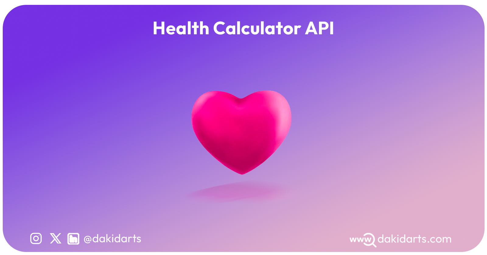

## Change Log:

##### (May 27, 2025)  

#### v0.0.4: Expanded Feature Set 

## 🔥 What’s New in v0.0.4

### 🫀 Cardiovascular & Diagnostic Calculators
- **QTc (Corrected QT Interval) Calculator** – Calculates QTc using multiple formulas: Bazett, Fridericia, Framingham, and Hodges.
- **ABI Calculator** – Computes the Ankle-Brachial Index for peripheral artery disease assessment.
- **Aortic Valve Area (AVA) Calculator** – Estimates aortic valve area using the continuity equation.
- **6-Minute Walk Test (6MWT) Calculator** – Estimates functional exercise capacity based on the 6-minute walk distance.

### 🔬 Metabolic & Calorie Calculators
- **RMR Calculator (Resting Metabolic Rate)** – Calculates energy burned at rest using Mifflin-St Jeor and Harris-Benedict formulas.
- **Katch-McArdle Calculator** – Computes BMR based on lean body mass.
- **Maintenance Calorie Calculator** – Estimates daily calorie needs for maintaining current weight.
- **Meal Calorie Calculator** – Estimates calories in a meal based on macronutrients.

### 🍽️ Nutrition & Macronutrient Calculators
- **Fat Intake Calculator** – Estimates recommended daily fat and saturated fat intake based on activity level.
- **Protein Calculator** – Calculates daily protein requirements in grams.
- **Carb Calculator** – Determines ideal daily carbohydrate intake.
- **Fiber Calculator** – Estimates recommended daily fiber intake based on sex and age.
- **Net Carbs Calculator** – Calculates net carbs by subtracting fiber and sugar alcohols from total carbs.
- **Simple Sugar Calculator** – Recommends max daily added sugar intake.
- **Sodium in Salt Calculator** – Converts salt intake to sodium and vice versa.

### 🧮 Diet & Lifestyle Calculators
- **Weight Watchers Points Calculator** – Calculates WW Smart Points based on calories, sugar, saturated fat, and protein.

### 📌 v0.0.4 Summary

**Total New Endpoints:** 16  
**Focus Areas:**  
- Cardiovascular health  
- Nutrition & diet  
- Energy expenditure  
- Clinical & diagnostic tools

---

##### (March, 2025)  

#### v0.0.3: Expanded Feature Set  

### New Features:  

🚀 **Added 17 new API endpoints for advanced health calculations:**  

**Ponderal Index Calculator** - Calculates the Ponderal Index to assess weight distribution relative to height.

**Karvonen Formula Calculator** - Determines target heart rate zones using the Karvonen method based on age and resting heart rate.

**Geriatric BMI Calculator** - Computes BMI for older adults with adjusted interpretation based on age.

**Daily Vitamin Calculator** - Estimates recommended daily vitamin intake based on age, gender, and lifestyle factors.

**Keto Calculator** - Calculates macronutrient intake for a ketogenic diet based on weight, activity level, and fitness goals.

**Body Roundness Index (BRI) Calculator** - Measures body roundness and fat distribution to assess health risks.

**Lean Body Mass (LBM) Calculator** - Computes lean body mass using the Boer formula for men and women.

**Body Surface Area (BSA) Calculator** - Determines body surface area using formulas like Du Bois, Mosteller, and others.

**Blood Sugar Converter** - Converts blood glucose levels between mmol/L and mg/dL units.

**Diabetes Risk Calculator** - Predicts Type 2 Diabetes risk over the next 7.5 years based on medical research and key health metrics.

**HOMA-IR Calculator** - Calculates the Homeostatic Model Assessment for Insulin Resistance, a key marker of insulin sensitivity.

**QUICKI Calculator** - Computes the Quantitative Insulin Sensitivity Check Index for assessing insulin resistance.

**Cholesterol Ratio Calculator** - Determines cholesterol ratios (TC/HDL, LDL/HDL, and TG/HDL) to assess cardiovascular risk.

**Cholesterol Units Converter** - Converts cholesterol levels between mg/dL and mmol/L for TC, HDL, and LDL.

**Triglycerides Concentration Converter** - Converts triglyceride values between mg/dL and mmol/L.

**VLDL Calculator** - Estimates Very Low-Density Lipoprotein (VLDL) using Friedewald and Wilson equations.

**LDL Calculator** - Computes Low-Density Lipoprotein (LDL) using the Friedewald equation based on TC, HDL, and TG values. 

🔹 **All endpoints support both GET & POST requests.**  
🔹 **Metric & Imperial units are supported where applicable.**  
🔹 **Improved response accuracy and error handling.**  

---------------

#### v0.0.2: Expanded Feature Set 

### New Features:

- **US Army Body Fat Calculator**: Calculate body fat percentage based on the US Army standards.
  
- **US Navy Body Fat Calculator**: Determine body fat percentage using the US Navy method.

- **Estimated Average Glucose (eAG)**: Estimate average blood glucose levels over a specified period.

- **Estimated Energy Requirement (EER)**: Calculate the daily energy intake required for maintaining energy balance.

- **Total Daily Energy Expenditure (TDEE)**: Determine total energy expenditure including basal metabolic rate and physical activity level.

- **Basal Energy Expenditure (BEE)**: Calculate the energy expended at rest without any additional activity.

- **Total Energy Expenditure (TEE)**: Assess the total energy expended throughout the day, including basal metabolic rate and physical activity.

- **Micronutrient Requirements**: Calculate daily requirements for essential vitamins and minerals based on individual characteristics.

---------------

#### Release v0.0.1

### Key Features: 

🔍 A Body Shape Index (ABSI): Assess body shape and health risks.

📏 Adjusted Body Weight (AjBW): Calculate ideal body weight for individual health goals.

📊 Body Adiposity Index (BAI): Estimate body fat percentage for improved health tracking.

📐 Body Frame Size Index (BFSI): Determine body frame size and tailor fitness plans.

⚖️ Body Mass Index (BMI): Measure body fat based on height and weight.

🧮 Body Fat Percentage: Calculate precise body fat composition.

🔥 Basal Metabolic Rate (BMR): Understand daily energy expenditure at rest.

🍽️ Daily Caloric Needs (DCN): Customize daily calorie intake for weight management.

💧 Daily Water Intake (DWI): Ensure optimal hydration levels for health and fitness.

💪 The FFMI (Fat-Free Mass Index): Assess muscle development and fitness progress.

❤️ Target Heart Rate (THR): Set target heart rates for effective workouts.

🍎 Macronutrients Distribution: Balance nutrition with insights into carbohydrates, proteins, and fats.

🏋️‍♀️ Ideal Body Weight (IBW): Calculate ideal weight ranges for health optimization.

---

✅ **Next Steps:**  
- Expand API functionality with more **health and wellness calculators**.  
- Optimize processing time for faster response rates. 
For more details on the Health Calculator API, refer to the [README](https://github.com/dakidarts/health-calculator-api/blob/main/README.md).

Thank you for your continued support and feedback! We are committed to enhancing the Health Calculator API with new features and improvements.
