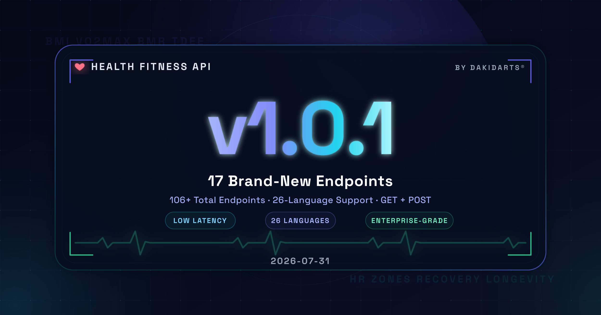

## Change Log:

### v1.0.1 – 17 New Endpoints + 26 Languages (Latest)
**Released:** July 31, 2026

##### 🔥 What's New in v1.0.1
- **17 brand-new endpoints** across body composition, cardiovascular, kidney function, strength, metabolism, nutrition, recovery, and risk screening
- **GET + POST** support on every new endpoint
- **Structured, actionable responses** with risk categories, labels, summaries, and rich `_api_metadata_` for enterprise logging & analytics
- **26-language response support** (up from 8) — 18 new languages: Bengali (bn), Gujarati (gu), Indonesian (id), Italian (it), Korean (ko), Marathi (mr), Dutch (nl), Punjabi (pa), Polish (pl), Romanian (ro), Russian (ru), Tamil (ta), Telugu (te), Thai (th), Turkish (tr), Urdu (ur), Vietnamese (vi), Chinese (zh)

#### Body Composition & Health Screening
- **Waist To Height (WHtR) API** — waist-to-height ratio with cardiometabolic risk classification
- **Sarcopenia Risk API** — grip strength, calf circumference, and SARC-F screening

#### Heart & Kidney Function
- **Cardiovascular Age API** — heart age estimation with risk category
- **Creatinine Clearance API** — Cockcroft-Gault kidney function and GFR stage classification

#### Performance & Strength
- **One Rep Max API** — 1RM with submaximal strength estimates (Epley, Brzycki, Lombardi)
- **Allometric Scaling API** — weight-independent strength index for fair comparisons
- **Grip Strength Ratio API** — relative grip strength normalization
- **Aerobic Decoupling API** — cardiovascular drift analysis for pacing and durability

#### Metabolism & Fuel Utilization
- **Metabolic Rate Adaptation API** — adaptive thermogenesis and expected vs. actual burn
- **Respiratory Quotient API** — carbohydrate vs. fat fuel utilization

#### Nutrition & Fueling
- **Glycemic Load API** — meal glycemic load with insulin-index context
- **Daily Carb Fueling API** — training-phase-specific carbohydrate targets
- **Sweat Rate Sodium API** — sweat loss with electrolyte replacement guidance
- **Hyponatremia Risk API** — hydration safety during long endurance events

#### Recovery & Wellness
- **Sleep Debt Recovery API** — 7-day sleep debt with recovery forecast
- **Caffeine Clearance API** — caffeine half-life and sleep cutoff timing

#### Risk Assessment
- **RED-S Risk API** — Relative Energy Deficiency in Sport screening

**Total New Endpoints:** 17  
**Cumulative Endpoints:** 107+  
**Target Use Cases:** Enterprise wellness platforms, digital coaching SaaS, corporate health programs, telehealth & longevity clinics, premium fitness apps, insurance risk engines, performance analytics dashboards

---

### v1.0.0 – Major Release
**Released:** March 5, 2026

##### 🔥 What’s New in v1.0.0
- **35 brand-new advanced fitness intelligence endpoints** purpose-built for personalization, metabolic protection, recovery science, longevity scoring, and elite performance auto-regulation
- **New direct enterprise platform** — full v1.0.0 feature set now live exclusively at `https://api.hefitapi.com/api/v1/` (RapidAPI contains only legacy endpoints)
- **Native multi-language support** across all responses (English, Spanish, German, French, Portuguese, Japanese, Hindi, Arabic)
- **GET + POST** support on every new endpoint for seamless integration into mobile, web, and backend workflows
- **Structured, actionable response format** including risk scores, readiness signals, adjustment recommendations, confidence bands, and rich `_api_metadata_` for enterprise logging & analytics

#### Fitness Programming & Periodization
- **Weekly & Daily Training Plans** — intelligent 7-day splits with session focus, intensity zoning, and built-in recovery blocks tailored to age, goal, and training frequency
- **Macro Cycling Logic** — automatic training-day vs rest-day macro splits with metabolic adjustment intelligence
- **Hydration & Electrolyte Planning** — dynamic baseline + session-specific targets factoring ambient conditions and workout demands
- **Glycogen Replenishment Protocols** — precise carb timing, sodium guidance, and recovery fueling windows post-workout
- **Meal Timing & Nutrient Distribution** — goal-aligned schedules with optimized protein pulsing and peri-workout windows
- **Deload Automation** — intelligent trigger detection and structured volume/intensity reduction templates

#### Performance Monitoring & Progression
- **Workout Calorie Burn Forecasting** — activity-specific estimates with confidence intervals and environmental modifiers
- **Safe Progression Targets** — weekly bodyweight and performance trajectories with medically-informed guardrails
- **VO2max Estimation Engine** — field-test derived estimates (Cooper, 1.5-mile) with fitness classification and percentile benchmarking
- **Heart Rate Zone Modeling** — Karvonen-style zones optimized for fat oxidation, aerobic threshold, or VO2 development
- **Strength Benchmarking & Relative Ratios** — classification against population standards with compound lift ratio insights
- **Race Time Projections** — 10K / half / full marathon forecasts from recent performances and mileage data

#### Recovery & Readiness Intelligence
- **Daily Recovery Score** — composite readiness metric from sleep, HRV, resting HR, and soreness with prioritized action steps
- **Central Nervous System Fatigue Index** — CNS load tracking with neural recovery status and same-day stimulus guidance
- **Muscle Group Recovery Timeline** — hour-precise retraining windows, overtraining alerts, and active recovery prescriptions
- **Adaptive Training Load Regulation** — real-time “Push / Maintain / Pull Back” decisions based on readiness inputs — auto-regulation delivered as an API

#### Check-in & Analytics Layer
- **Weekly Check-in Analysis** — interprets weight, strength, recovery, and adherence trends with clear adjustment recommendations and momentum scoring
- **Weekly Volume Load Analyzer** — hypertrophy-zone classification, distribution scoring, and overuse early-warning system

#### Longevity & Cardiometabolic Health
- **Longevity Score (0–100)** — composite metric from VO2max, resting HR, body fat, sleep, and activity volume with prioritized lifestyle levers
- **Cortisol & Stress Load Index** — integrated nervous system stress scoring with overtraining and recovery warnings
- **Metabolic Adaptation Risk Detector** — flags adaptation risk during prolonged deficits with reverse-diet phasing guidance
- **Injury Risk Scoring** — preventive focus areas and mobility interventions based on training load and history
- **Micronutrient Deficiency Flags** — diet-pattern-based risk scoring (Vitamin D, Iron, Magnesium, B12) with food-first fixes
- **Sedentary & Postural Risk Index** — musculoskeletal and longevity impact scoring with daily mobility prescriptions

#### Body Recomposition & Metabolic Tools
- **Body Recomposition Forecaster** — predicts fat loss vs muscle gain trajectories with probability scoring and strategy tuning
- **Insulin Sensitivity Estimator** — metabolic health rating with carb-tolerance and lifestyle guidance
- **NEAT Contribution Estimator** — quantifies non-exercise thermogenesis burn and compensation risk
- **Reverse Diet Planner** — structured calorie-ramping schedule to protect metabolism post-deficit

#### Optimization & Strategy Engines
- **Plateau Breaker Logic** — intelligent refeed, diet-break, and volume-manipulation strategies for stalled progress
- **Sleep Optimization Protocol** — circadian-aligned recommendations based on consistency, caffeine, and evening habits
- **Running Economy Analyzer** — efficiency scoring and lever-specific improvement suggestions
- **Mobility Limitation Scanner** — joint-specific restriction severity with corrective warmup customization
- **Fasted Training Risk Analyzer** — quantifies muscle-loss and performance trade-offs with strategic alternatives
- **Training Personality & Archetype Profiler** — matches athlete style to ideal programming and burnout patterns

**Total New Endpoints:** 35  
**Cumulative Endpoints:** 89+  
**Target Use Cases:** Enterprise wellness platforms, digital coaching SaaS, corporate health programs, telehealth & longevity clinics, premium fitness apps, insurance risk engines, performance analytics dashboards

This release transforms Health Fitness API into a full-stack **fitness intelligence infrastructure** — ready for high-scale, personalized, recovery-first digital health experiences.

##### (May 27, 2025)  

#### v0.0.4: Expanded Feature Set 

## 🔥 What’s New in v0.0.4

### 🫀 Cardiovascular & Diagnostic Calculators
- **QTc (Corrected QT Interval) Calculator** – Calculates QTc using multiple formulas: Bazett, Fridericia, Framingham, and Hodges.
- **ABI Calculator** – Computes the Ankle-Brachial Index for peripheral artery disease assessment.
- **Aortic Valve Area (AVA) Calculator** – Estimates aortic valve area using the continuity equation.
- **6-Minute Walk Test (6MWT) Calculator** – Estimates functional exercise capacity based on the 6-minute walk distance.

### 🔬 Metabolic & Calorie Calculators
- **RMR Calculator (Resting Metabolic Rate)** – Calculates energy burned at rest using Mifflin-St Jeor and Harris-Benedict formulas.
- **Katch-McArdle Calculator** – Computes BMR based on lean body mass.
- **Maintenance Calorie Calculator** – Estimates daily calorie needs for maintaining current weight.
- **Meal Calorie Calculator** – Estimates calories in a meal based on macronutrients.

### 🍽️ Nutrition & Macronutrient Calculators
- **Fat Intake Calculator** – Estimates recommended daily fat and saturated fat intake based on activity level.
- **Protein Calculator** – Calculates daily protein requirements in grams.
- **Carb Calculator** – Determines ideal daily carbohydrate intake.
- **Fiber Calculator** – Estimates recommended daily fiber intake based on sex and age.
- **Net Carbs Calculator** – Calculates net carbs by subtracting fiber and sugar alcohols from total carbs.
- **Simple Sugar Calculator** – Recommends max daily added sugar intake.
- **Sodium in Salt Calculator** – Converts salt intake to sodium and vice versa.

### 🧮 Diet & Lifestyle Calculators
- **Weight Watchers Points Calculator** – Calculates WW Smart Points based on calories, sugar, saturated fat, and protein.

### 📌 v0.0.4 Summary
